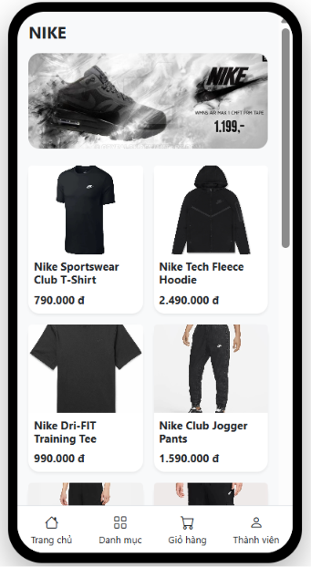
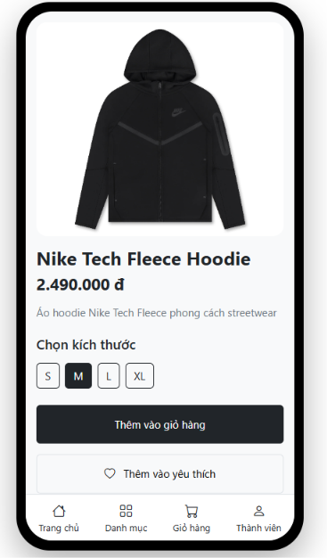
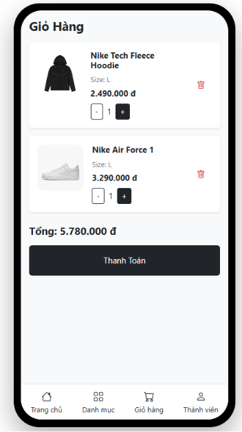
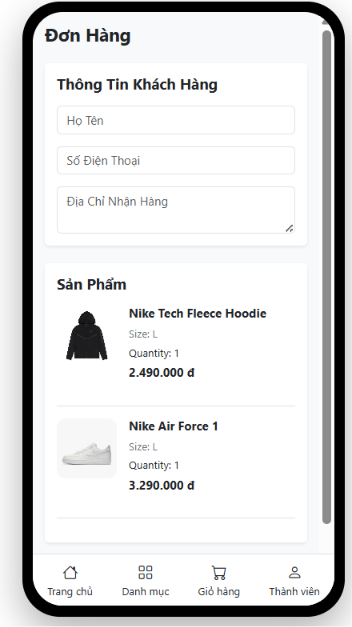
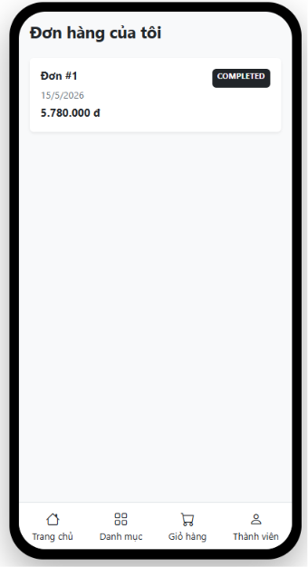
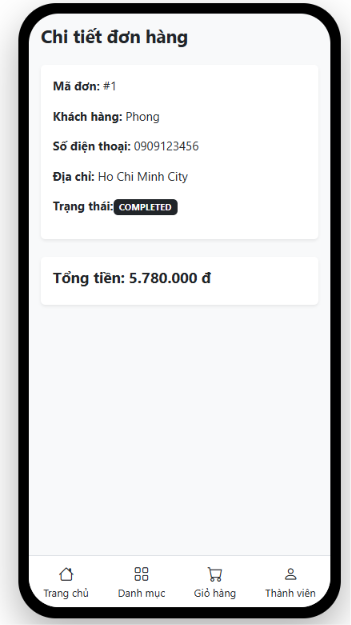
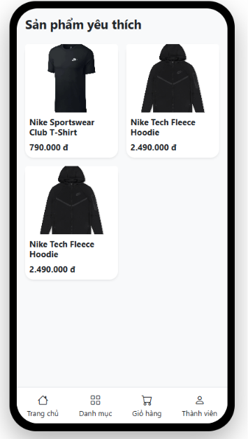
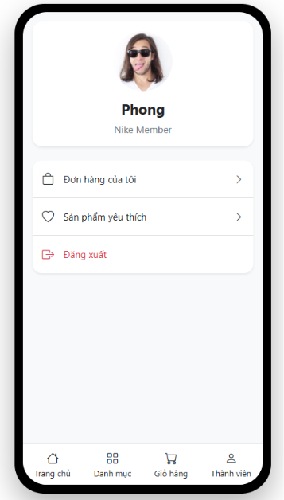

# Fashion Store Mini App

Fullstack Ecommerce Mini App được xây dựng bằng Spring Boot và Vue 3.

---

# Tech Stack

## Backend
- Java 17
- Spring Boot
- Spring Data JPA
- MySQL
- Maven

## Frontend
- Vue 3
- Vue Router
- Bootstrap 5
- Axios
- Vite

---

# Main Features

- Hiển thị danh sách sản phẩm
- Xem chi tiết sản phẩm
- Lọc sản phẩm theo danh mục
- Thêm sản phẩm vào giỏ hàng
- Chọn size sản phẩm
- Thanh toán đơn hàng
- Xem lịch sử đơn hàng
- Xem chi tiết đơn hàng
- Thêm sản phẩm yêu thích
- Xem danh sách sản phẩm yêu thích

---

# Project Structure

```text
fashion-store-miniapp
│
├── fashion-store-api
├── fashion-store-frontend
└── README.md
```
# Database Tables

- categories
- products
- users
- bills
- bill_details
- favorites

---

# Developer

Ngô Nam Phong

Software Development Student

---

# Screenshots

## Home Page



## Product Detail



## Cart



## Checkout



## Orders



## Order Detail



## Favorites



## Member

